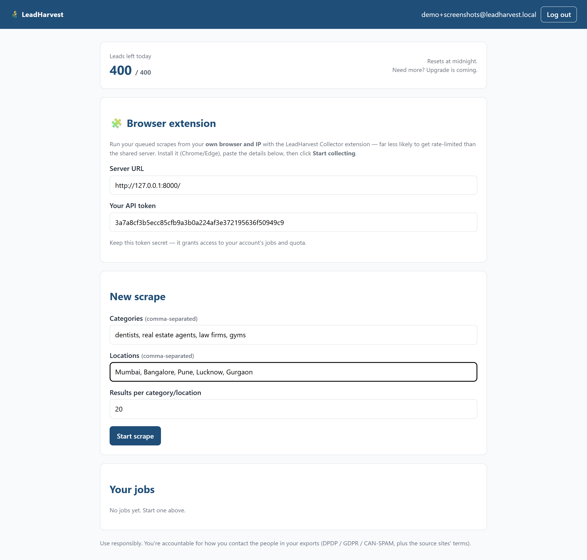
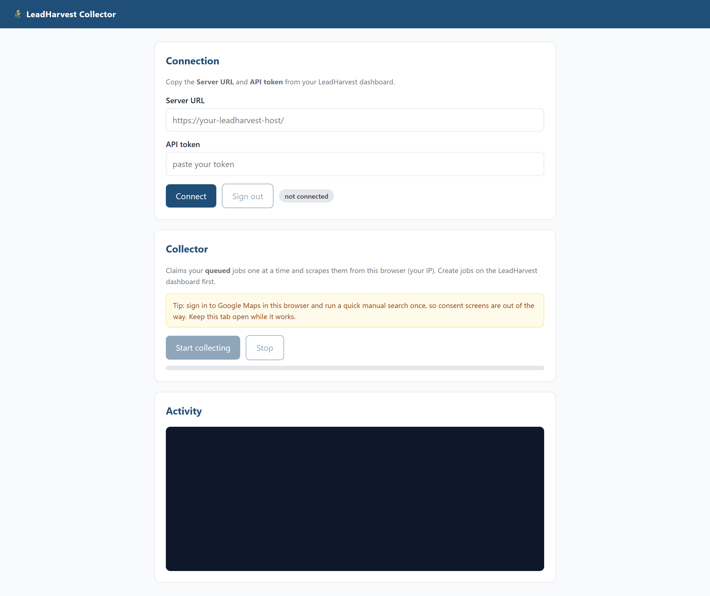
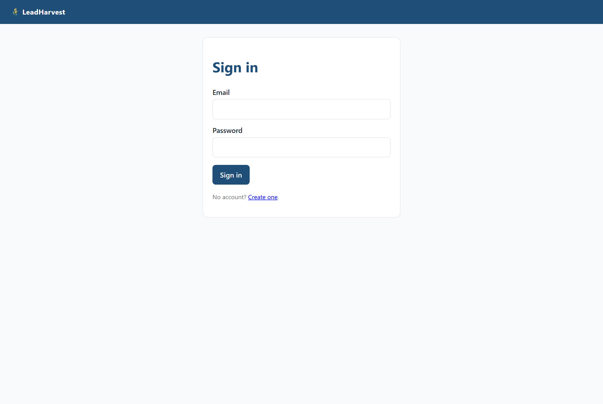

# LeadHarvest — Google Maps lead & email scraper

A self-hosted lead-generation toolkit. Point it at one or more business
categories ("dentists", "law firms", "interior designers"...) and one or more
cities, and it gives you back a CSV / XLSX of business name, website, phone,
address, rating, **and the contact emails harvested from each business's
website** — all on your own machine, with no paid APIs.

It ships in three layers you can mix and match:

| Layer | Use when |
|---|---|
| **CLI** (`maps_email_scraper.py`) | You want a one-shot scrape, no UI, no account. |
| **Web app** (`webapp/`) | You want a small multi-user SaaS-shaped front-end with quotas, job history, and downloads. |
| **Browser extension** (`extension/`) | You want users to scrape from *their own* browser and IP instead of the server's, so Google Maps doesn't rate-limit a single egress. |

The web app and extension share the same database; they only differ in **who
does the work**.

---

## Screenshots

**Dashboard** — daily quota, new-scrape form, browser-extension connection
details, and job history all on one page:



**Collector extension** — paste the Server URL + API token from the dashboard,
click *Start collecting*, and the extension claims your queued jobs and
scrapes them from your own browser/IP:



**Sign-in / sign-up** — small, single-purpose. New users go through *Create
one* to land straight on the dashboard:



---

## How the pieces fit together

```
                       ┌────────────────────────────────────────┐
   browser  ──login──▶ │ FastAPI web app (webapp/main.py)       │
                       │  • accounts, quotas, dashboard         │
                       │  • job queue lives in the DB           │
                       │  • download CSV / XLSX / JSON          │
                       └─────┬────────────────┬─────────────────┘
                             │                │
                  poll & run │                │ claim & run
                             ▼                ▼
                ┌──────────────────────┐  ┌──────────────────────────┐
                │ server worker        │  │ browser extension        │
                │ (webapp/worker.py)   │  │ (extension/, MV3)        │
                │ • runs on YOUR box   │  │ • runs in each user's    │
                │ • one server IP      │  │   browser, on their IP   │
                └──────────┬───────────┘  └──────────┬───────────────┘
                           │                         │
                           └────── shared ───────────┘
                                      ▼
                    ┌────────────────────────────────────┐
                    │  maps_email_scraper.run_scrape()   │
                    │  Stage 1: Playwright → Maps        │
                    │  Stage 2: requests/BS4 → emails    │
                    └────────────────────────────────────┘
                                      ▼
                          data/jobs/<id>/leads.csv
```

The CLI hits `run_scrape()` directly. The web app never blocks a request on a
scrape — it only enqueues. Exactly one of {server worker, extension} should be
claiming jobs at a time (see [Troubleshooting](#troubleshooting)).

---

## Prerequisites

- **Python 3.10+** (3.11 / 3.12 fine).
- **Git** (only if you're cloning instead of downloading a zip).
- **A Chromium browser** for the extension (Chrome or Edge) — only needed if
  you want the extension path. Playwright installs its own bundled Chromium
  for the CLI / server worker.
- Tested on Windows 10/11, macOS, and Linux. Commands below show Windows
  PowerShell syntax — the substantive flags are the same on bash/zsh.

> Disk: a clean install is ~600 MB (Playwright's Chromium dominates).

---

## Quick start (CLI, 60 seconds)

If you just want a CSV of leads with no front-end at all:

```powershell
git clone <your-fork-or-this-repo>.git
cd email-scraper

python -m venv .venv
.\.venv\Scripts\Activate.ps1            # macOS/Linux: source .venv/bin/activate

pip install -r requirements.txt
playwright install chromium

python maps_email_scraper.py --location "Mumbai" --categories "dentists" --limit 20
```

When it's done you'll have a `leads.csv` in the current directory with one row
per business. Open it in Excel, or pretty it up first:

```powershell
python format_leads.py --input leads.csv --output leads.xlsx
```

### Other useful CLI shapes

```powershell
# Multiple categories x multiple cities (cartesian product)
python maps_email_scraper.py `
    --categories "dentists,real estate agents,law firms,gyms" `
    --location   "Mumbai,Bangalore,Pune,Lucknow,Gurgaon" `
    --limit 20 --output leads_in.csv

# All Indian Tier-1 + Tier-2 cities, baked-in list
python maps_email_scraper.py --india --categories "interior designers" --limit 30

# Worldwide mega-run (be patient — and respectful of Maps)
python maps_email_scraper.py --worldwide --categories "law firms" --limit 25
```

The CSV columns are stable across CLI / web / extension paths, so any
downstream tooling (`format_leads.py`, your CRM importer, etc.) works the same
way regardless of who produced the file.

---

## Run the web app locally

The web app turns the CLI into a tiny multi-user product: signup, dashboard,
**daily per-user lead quota** (default 400), per-job download links.

Open **two terminals** from the repo root.

**Terminal 1 — the worker** (only run this if you're NOT using the extension):

```powershell
python -m webapp.worker
```

**Terminal 2 — the web server:**

```powershell
uvicorn webapp.main:app --host 127.0.0.1 --port 8000 --reload
```

Open <http://127.0.0.1:8000>, register an account, submit a scrape from the
dashboard. The worker prints `running job N…` / `job N finished` as it goes,
and the dashboard updates with progress and a download button.

> **Run both processes from the repo root**, so `import maps_email_scraper`
> and `import format_leads` resolve.

### Configuration (env vars)

| Var | Default | Notes |
|---|---|---|
| `DATABASE_URL` | `sqlite:///webapp.db` | Set to a Postgres / Supabase URL for prod. |
| `SECRET_KEY` | `dev-insecure-change-me` | **Must** be a random secret in prod (signs the session cookies). |
| `DAILY_QUOTA` | `400` | Lead allowance per user per day. Counter rolls over at midnight UTC. |
| `API_CORS_ORIGINS` | `*` | Comma-separated allowlist for the `/api/*` endpoints the extension uses. |

Example (PowerShell):

```powershell
$env:SECRET_KEY = "use-a-real-random-string-here"
$env:DAILY_QUOTA = "1000"
uvicorn webapp.main:app --host 0.0.0.0 --port 8000
```

### What the dashboard gives you

- **Submit a job** — comma-separated categories, comma-separated locations,
  `limit_per_query` (results per category × city), `max_leads` (overall cap).
- **Live progress** — phase (`maps` → `emails`), `done/total`, lead count.
- **Download** — CSV, XLSX (formatted, deduped, validated emails highlighted),
  or JSON. The XLSX route runs `format_leads.py` on the fly.
- **API token & connection URL** — what the extension needs to connect.

---

## Run the browser extension (distributed scraping)

**Why you want this:** Google Maps rate-limits aggressively. A single server
IP burning through hundreds of searches will get throttled fast. The extension
flips that: each user runs the scraper in their own browser, using their own
IP and Google session. The server only hands out jobs and stores results.

### Install (unpacked)

1. Make sure the web app is running (see above) and **stop the server-side
   worker** if it's running — only one collector should be claiming jobs.
2. In Chrome / Edge, open `chrome://extensions` (or `edge://extensions`).
3. Toggle **Developer mode** (top-right).
4. Click **Load unpacked** and pick the `extension/` folder.
5. Click the LeadHarvest icon in the toolbar. A **Collector** tab opens.

### Connect & start

1. On your dashboard at <http://127.0.0.1:8000>, copy your **Server URL** and
   **API token** (they're in the "Browser extension" card).
2. Paste both into the Collector's **Connection** card → **Connect**. You
   should see your email and remaining quota.
3. Submit one or more jobs on the dashboard. They start as `queued`.
4. In the Collector, click **Start collecting**. It claims your queued jobs
   one at a time, runs them in a hidden tab, and POSTs leads back. Watch the
   Activity log; the dashboard reflects progress live.
5. Keep the Collector tab open while it works — closing it stops the run.

### Permissions the extension asks for, and why

- `<all_urls>` — to fetch arbitrary business websites for email extraction
  (Stage 2) and to inject the Maps scraper.
- `scripting`, `tabs` — to open and drive the background Maps tab.
- `storage` — to remember your server URL and token across browser restarts.

### Pick one collector

`webapp/worker.py` and the extension are **both** job consumers polling the
same queue. If both are running, whichever polls first wins and the other
silently sees nothing to do. Pick one:

| You want… | Run | Don't run |
|---|---|---|
| Distributed / per-user IP | The extension | `python -m webapp.worker` |
| Server-side single host | `python -m webapp.worker` | The extension |

---

## Output: what's in the CSV

Every path (CLI, server worker, extension) writes the same schema:

| Column | Notes |
|---|---|
| `category` | The search term, e.g. `dentists`. |
| `location` | The city / area searched. |
| `name` | Business name as shown on Maps. |
| `website` | Cleaned site URL (sponsored / ad redirect URLs are stripped to the real site). |
| `phone` | If shown on Maps. |
| `address` | Maps' formatted address. |
| `rating` | Star rating, if present. |
| `emails` | `;`-separated list. Common junk domains (wixpress, sentry, godaddy placeholders, `example.com`) and file-suffix false positives are filtered. |

Dedupe key: website host (preferred) → name + phone digits (fallback). So if
you re-run the same job, you keep your existing CSV and only net-new
businesses get appended.

To turn the CSV into a polished, outreach-ready Excel workbook:

```powershell
python format_leads.py --input leads.csv --output leads.xlsx
```

That produces:

- **Leads** — cleaned, deduped, one email per row, rows with an email
  highlighted, frozen header, autofiltered.
- **Summary** — counts by category, by location, by tier (for India runs).

---

## Project layout

```
email-scraper/
├── maps_email_scraper.py     # CLI + run_scrape() — the scraping engine
├── format_leads.py           # CSV → styled XLSX with analytics
├── requirements.txt
├── webapp/                   # FastAPI app (accounts, dashboard, queue, downloads)
│   ├── main.py
│   ├── api.py                # /api/* — token-authed endpoints the extension calls
│   ├── worker.py             # `python -m webapp.worker` — server-side runner
│   ├── models.py             # User, ScrapeJob (the queue IS the table)
│   ├── db.py
│   ├── exporters.py          # CSV / XLSX / JSON formatters
│   ├── security.py
│   └── templates/            # Jinja2 HTML
├── extension/                # Chrome/Edge MV3 extension ("Collector")
│   ├── manifest.json
│   ├── background.js
│   ├── runner.html / runner.js
│   └── lib/                  # shared scrape helpers (page DOM, email regex)
└── data/jobs/<id>/leads.csv  # per-job results (created at runtime)
```

---

## Troubleshooting

**Dashboard says "running" but the extension shows no activity.**
The server worker grabbed the job first. Stop `python -m webapp.worker`, then
manually reset the stuck job back to `queued`:

```powershell
python -c "from webapp.db import SessionLocal; from webapp.models import ScrapeJob; s=SessionLocal(); j=s.query(ScrapeJob).filter_by(status='running').first(); j.status='queued'; j.phase=''; j.progress_done=0; j.progress_total=0; s.commit(); print('reset', j.id)"
```

The extension's next poll will pick it up. Any leads the worker already wrote
to `data/jobs/<id>/leads.csv` are preserved (the dedupe layer keeps them).

**Playwright errors on startup / "browser not found".**
You skipped `playwright install chromium`. Run it from the repo root with the
venv active.

**Maps returns nothing / scraping is super slow.**
Google occasionally changes Maps' DOM. The selectors live in
`maps_email_scraper.py` (server side) and `extension/lib/pagescrape.js`
(client side) and have to stay in sync. If the worker prints "0 results" for
known-busy queries, those are the files to look at.

**"Quota exhausted" sooner than expected.**
Quota is debited by **leads actually delivered**, not requested. You can bump
a specific user's allowance directly:

```powershell
python -c "from webapp.db import SessionLocal; from webapp.models import User; s=SessionLocal(); u=s.query(User).filter_by(email='you@example.com').first(); u.daily_quota=1000; s.commit(); print(u.daily_quota)"
```

Or change the default for new signups via the `DAILY_QUOTA` env var.

**Windows: `cp1252` / encoding errors in the console.**
The scraper reconfigures stdout to UTF-8 on import, but if you `> redirect` to
a file, set `PYTHONIOENCODING=utf-8` first.

**Port 8000 is busy.**
`uvicorn webapp.main:app --port 8080` — anything you want.

---

## Going to production (what's deliberately not in scope here)

This repo is a *local-first, single-host* tool. Before exposing it to real
external users you'll want:

- **Proxy rotation / anti-block.** The clean place to add per-request proxy
  pools is inside `scrape_maps()` and `extract_emails_from_site()` in
  `maps_email_scraper.py`. Required before any public scale even with the
  extension path, because Stage 2 still fetches arbitrary websites.
- **Billing / tiers.** `User.daily_quota` is already the lever. Wire Stripe
  (or whatever) to bump it on subscription events.
- **Compliance.** DPDP (India), GDPR (EU), CAN-SPAM (US). At minimum: a
  suppression list, an opt-out endpoint, terms putting contact responsibility
  on the user, and a sourcing review against the target sites' ToS. Treat
  this as a launch blocker.
- **Delivery emails.** The worker / `/api/jobs/{id}/complete` handler is the
  right place to fire a "your leads are ready" email.
- **Distributed queue.** Swap the DB poll in `webapp/worker.py` for RQ /
  Celery + Redis. `run_scrape()` itself doesn't change.
- **Real DB.** Set `DATABASE_URL` to Postgres. The SQLAlchemy models are
  vanilla and migrate cleanly with Alembic.

---

## Responsible use

You're collecting personal data (business contact info, but personal in many
jurisdictions). Even with the extension running on each user's own IP, you
are still subject to:

- the source sites' Terms of Service (Maps and each business website);
- your local privacy laws (DPDP, GDPR, CCPA, …);
- anti-spam laws (CAN-SPAM, CASL, India's UCC regulations, …) the moment you
  contact anyone you collected.

This tool gives you the data. It does not absolve you of how you use it. Don't
sell scraped data, don't spam, honor opt-outs, and treat the people behind the
listings the way you'd want to be treated.

---

## License & contributions

Personal / internal use. Open an issue or PR if you want to extend selectors,
add new built-in city lists, or harden any of the "production" gaps above.
